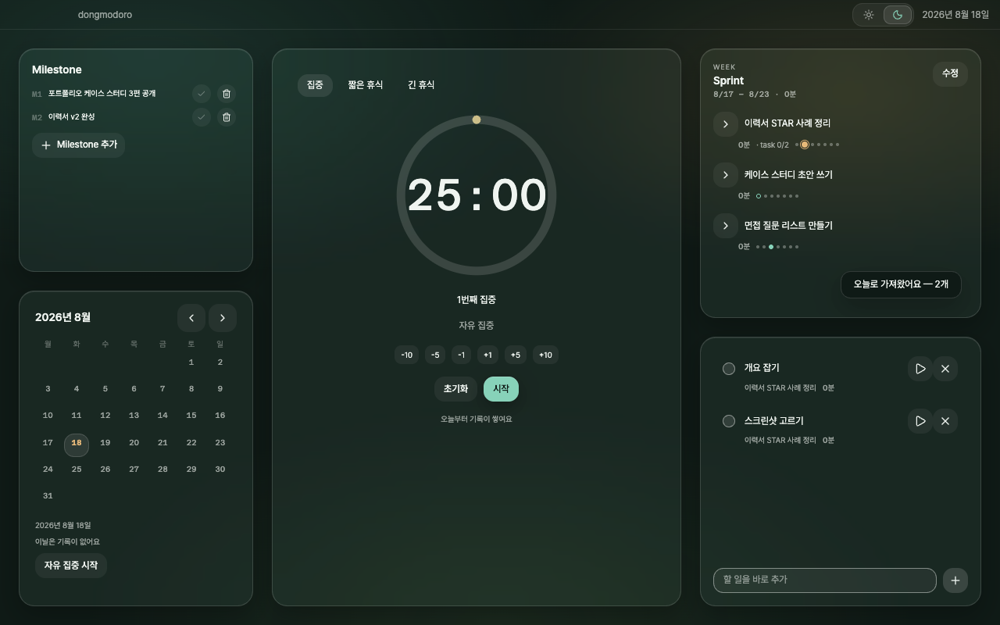
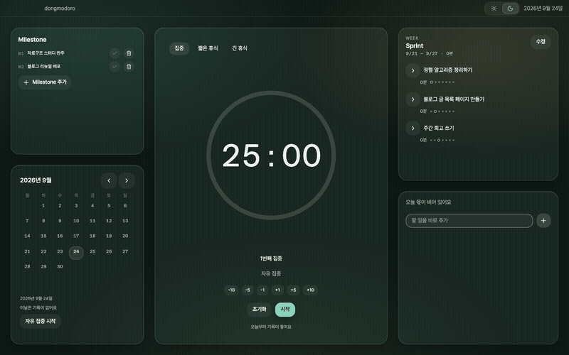
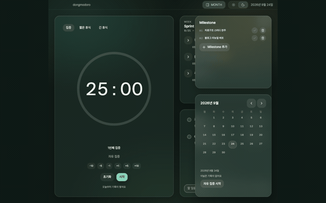
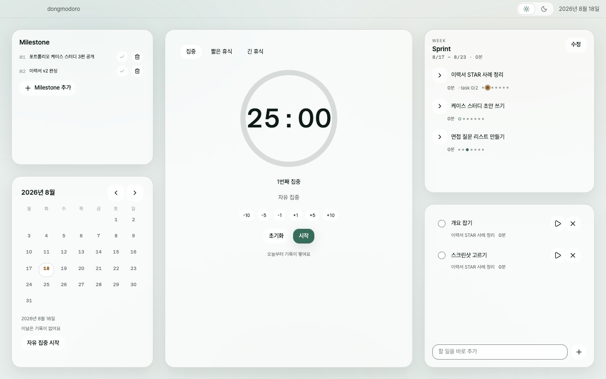

# dongmodoro

[](https://github.com/easyDong19/dongmodoro/releases/latest)

주 → 오늘 계획과 뽀모도로 타이머를 한 화면에 둔 macOS 데스크톱 앱입니다. 로컬 전용이고
로그인도 동기화도 없습니다.



## 왜 만들었나

AI 에게 일을 시키면서 탭을 여러 개 띄워두고 여러 작업을 동시에 굴렸더니 주의력이
갈렸습니다. 하나에 붙어 있는 시간이 짧아졌고, 여기에 계획 도구(노션·투두)와 타이머가
따로 노는 문제가 겹쳤습니다 — 하루를 시작할 때마다 둘 사이를 왕복했고, 그 왕복이 계획
자체를 부담으로 만들었습니다.

집중을 끌어올리려고 직접 쓸 앱을 만들었습니다. 그래서 성공 기준도 집중 시간 총량이나
달성률이 아니라 **계획과 실행이 한 화면에서 이어지는 것** 하나입니다.

## 기능

- **주간 계획 (Sprint)** — 이번 주에 할 일을 제목으로 잡고 요일에 배치합니다. 계획
  시점에 숫자를 입력하는 자리가 없습니다.
- **오늘 목록** — 지금 뭐부터 할지만 답합니다. Sprint 를 task 로 쪼개 드로어에서
  가져오는 것이 기본이고, 급한 일은 바로 추가할 수도 있습니다.
- **뽀모도로 타이머** — 오늘 목록에서 골라 바로 돌립니다. 기록한 세션은 Sprint 카드의
  측정 시간으로 되돌아옵니다.
- **뽀모 길이 조절** — 타이머 카드의 `±` 칩으로 대기 중에 바꿉니다. 조절한 길이가 곧
  기준이 되고, 다음 세션부터 적용됩니다.
- **주간 정산** — 주가 끝나면 남은 항목을 화면 하나에서 이월·폐기로 처분합니다. 몇 주
  비우고 돌아와도 화면은 하나이고 항목 수만 늘어납니다.
- **Milestone 과 달력** — 한 달에 뭘 끝내 놓을지를 제목으로만 적습니다(수치 입력이
  없습니다). Sprint 를 여기 연결하면 이번 주 진행이 범위 라벨과 함께 보입니다. 달력은
  기록이 있는 날을 점으로 찍고, 날짜를 고르면 그날 뭘 하려 했는지가 복원됩니다. 두
  카드는 달 이동을 공유합니다.
- **좁은 창 대응** — 창을 화면 절반에 두면 Milestone·달력이 접히고 타이머가 자리를
  물려받습니다. 접힌 카드는 타이틀바의 `MONTH` 버튼으로 열어 봅니다.
- **다크·라이트 전환** — 테마 주인이 OS 가 아니라 앱입니다. 첫 페인트부터 고른 테마로
  뜹니다.

트레이 상주는 아직 없습니다 — 창을 닫으면 앱이 종료됩니다. 창은 720px 아래로 줄어들지
않습니다(그보다 좁은 1컬럼 화면은 아직 없습니다). 범위는 [PRODUCT.md](PRODUCT.md) 가
소유합니다.

### 동작을 지탱하는 규칙 세 가지

- **진행의 통화는 측정 시간입니다.** 화면의 모든 진행 숫자는 완료된 focus 세션에서
  타이머가 실제로 돈 시간의 합입니다. 뽀모는 타이머 사이클 단위로만 남습니다 —
  1뽀모 = focus 세션 1회 완료이며 **길이와 무관합니다.** 길이를 바꿔도 과거 기록이
  재해석되지 않습니다.
- **진행량을 저장하지 않습니다.** 모든 진행 표시는 세션에서 조회 시점에 위로
  파생됩니다. 두 화면이 다른 숫자를 말할 수 없습니다.
- **막는 화면이 없습니다.** 계획 확정은 항상 성공합니다. 사실만 보여주고 판단은
  사용자가 합니다.

## 화면

계획에서 실행까지 — task 를 오늘 목록으로 가져와 타이머를 돌립니다.



창을 좁히면 계획 카드가 접히고 타이머가 남습니다. `MONTH` 버튼이 접힌 카드를 엽니다.



라이트 테마도 있습니다.



## 설치 (macOS, Apple Silicon)

[Releases](https://github.com/easyDong19/dongmodoro/releases) 에서 `.dmg` 를 받아
`dongmodoro.app` 을 응용 프로그램 폴더로 옮깁니다.

**첫 실행은 막힙니다.** 앱이 깨진 것이 아니라 macOS 가 내려받은 미공증 앱을 기본으로
차단하는 것입니다. 서명은 유료 개발자 계정이 있어야 해서 만드는 사람과 쓰는 사람이 같은
동안에는 받지 않기로 했습니다
([ADR-028](docs/architecture/decisions/adr-028-code-signing.md)). 격리 속성을 지우면
열리고 **한 번만** 하면 됩니다.

```bash
xattr -dr com.apple.quarantine /Applications/dongmodoro.app
```

### 구버전에서 올라온다면

일부 판은 첫 실행에 DB 마이그레이션을 돌리며 **되돌릴 수 없습니다.** 앱이 마이그레이션
직전에 백업을 자동으로 만들지만, 백업만 되돌리면 새 앱이 같은 마이그레이션을 다시
돌립니다 — 실질 복귀선은 `백업 파일 + 이전 버전 설치 파일` 조합 하나뿐입니다. 올리기
전에 쓰던 판의 `.dmg` 를 보관해 두고, 해당 버전의
[릴리스 노트](https://github.com/easyDong19/dongmodoro/releases)에서 업그레이드 절을
먼저 확인하세요.

## 개발

Node 22 LTS 이상, 패키지 매니저는 pnpm 만 씁니다
([ADR-004](docs/architecture/decisions/adr-004-packaging-deploy.md)) — npm·yarn 으로
설치하면 네이티브 모듈 빌드 허용 설정이 적용되지 않습니다.

```bash
pnpm install
pnpm dev          # 개발 실행 (창이 뜹니다)
pnpm test         # Vitest
pnpm typecheck    # main·renderer 두 tsconfig 를 각각 검사
pnpm lint         # ESLint — 아키텍처 경계 규칙 포함
pnpm build        # 프로덕션 빌드 (out/)
```

스택은 Electron + electron-vite + React 19 + TypeScript strict / better-sqlite3 +
drizzle-orm / zod 검증 IPC / TanStack Query / Tailwind CSS v4 + shadcn/ui / Vitest
입니다. 고른 이유는 전부 [ADR](docs/architecture/decisions/) 에 있습니다 — 스택이
코드보다 먼저 결정된 프로젝트입니다.

커밋하면 husky 훅이 서식·린트·커밋 메시지 형식을 검사합니다. `--no-verify` 로 우회하지
않습니다. 폴더 경계도 문서가 아니라 ESLint 가 강제합니다 — `src/shared/` 가 Node·DOM 을
import 하거나, `src/main/db/` 밖에서 Drizzle 을 부르거나, 시간 모듈 밖에서 `new Date()`
를 쓰면 lint 가 실패합니다.

## 문서

이 저장소는 코드보다 결정의 기록이 큽니다. 처음 온 사람 기준 순서입니다.

1. [PRODUCT.md](PRODUCT.md) — 무엇을, 누구를 위해, 왜
2. [CONTEXT.md](CONTEXT.md) — 용어. 건너뛰면 `정산` 과 `리뷰` 를 섞어 쓰게 됩니다
3. [docs/features/README.md](docs/features/README.md) — 기능별 확정 기획
4. [docs/architecture/overview.md](docs/architecture/overview.md) — 스택·프로세스 구조
5. [docs/CLAUDE.md](docs/CLAUDE.md) — 문서 폴더별 책임 경계

문서끼리 충돌하면 순서가 정해져 있습니다. `docs/origin/` 의 초안은 항상 지고
`docs/features/` 의 확정 기획이 이깁니다. 시각 판단은
[design-system/principles.md](docs/design-system/principles.md) 가 기능 문서를 이깁니다.
`docs/plans/` 는 결정을 만들지 않고 참조만 합니다. 결정이 뒤집히면 기존 ADR 을 고치지
않고 superseded 표기 후 새 ADR 을 쌓습니다.

코드부터 보는 편이 빠르면 `src/shared/ipc/contracts.ts` (프로세스 사이를 오가는 것의
정의) → `src/main/ipc/handle.ts` (모든 IPC 가 지나는 한 지점) →
`src/main/db/schema.ts` (테이블 6개, CHECK 34개) → `src/main/index.ts` (부팅 순서와
실패 처리) 순이 짧습니다.

기여 규칙은 [CONTRIBUTING.md](CONTRIBUTING.md), 에이전트 작업 규칙은
[CLAUDE.md](CLAUDE.md) 에 있습니다.
